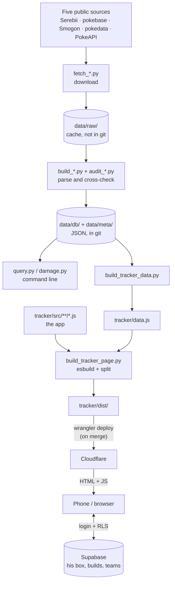

# How Champions Ledger works

This is the engineer's map of the repo. `README.md` says **what** the app is;
this file says **how** it is built, so you can open any file in VS Code and
know where it sits in the whole. Read it top to bottom once, then use it as an
index.

Every path below is clickable in VS Code (Ctrl+click). When this file and the
code disagree, the code wins; fix this file in the same PR.

---

## 1. The big picture

Two halves share one database of Champions facts:



- **Game facts** (species, moves, usage) are public, scraped, rebuilt nightly,
  committed as JSON in `data/`, and shipped *inside* the page.
- **His state** (box, builds, teams, GTS) is private, lives only in Supabase,
  and is read by the page after he signs in. The repo holds no copy.

That split is the single most important idea in the project: the page can be
public because it carries no personal row.

---

## 2. The stack

| Layer | Technology | Where | Why this and not something else |
|---|---|---|---|
| UI | **Vanilla JavaScript** (ES modules), HTML, CSS. No framework | `tracker/src/` | One user, one page. The DOM API is enough, and there is no framework version to keep up with |
| Module linking | **esbuild** (pinned in `package-lock.json`) | `scripts/build_tracker_page.py` | Turns twelve modules into one script plus a sourcemap. The browser tests run in jsdom, which cannot load module scripts |
| Database | **Supabase**: PostgreSQL, with PostgREST as the HTTP API, Auth for the login and Realtime for live updates | `tracker/supabase_schema.sql`, `supabase_migrate_*.sql` | Free hosted Postgres with login and row-level security built in |
| DB client | **supabase-js** (`@supabase/supabase-js`), inlined from `node_modules` (not a CDN) | `package.json` | A CDN would be a third party inside a page that holds the ledger |
| Hosting | **Cloudflare Workers**, static assets only | `tracker/wrangler.toml` → `tracker/dist/` | Free, fast, and the served folder is only `dist/`, so nothing private can leak |
| Scheduler | A second **Cloudflare Worker** (JavaScript, Web Crypto) | `cron/src/cron.js` | Starts the nightly GitHub workflow on time; GitHub's own schedule ran hours late |
| Data pipeline | **Python 3**, standard library only (`urllib`, `json`, `re`, `argparse`, `html`) | `scripts/` | The scripts need no `pip install`; the gate's linter does (`requirements.txt`) |
| Damage maths | **Smogon's damage-calc** (TypeScript, copied from upstream, bundled with esbuild) | `scripts/build_engine_bundle.py` → `tracker/engine.bundle.js`; `scripts/damage.py` → `scripts/smogon_engine.js` | The page and the terminal run the same engine; nothing ports the formula |
| Tests | **Node + jsdom** browser tests; **ESLint** with **globals**, **eslint-plugin-sonarjs** and **eslint-plugin-unicorn** for the JavaScript; **stylelint** with **stylelint-config-standard** for the CSS; **html-validate** for the markup; **ruff** and **vulture** for the Python; **jscpd** for copy-paste in all of them; Python audits | `tests/`, `eslint.config.mjs`, `stylelint.config.mjs`, `.htmlvalidate.mjs`, `ruff.toml`, `.jscpd.json`, `scripts/check_app.js`, `scripts/audit_*.py` | Tests run against the *built* page, which is the thing that ships |
| CI/CD | **GitHub Actions**, a GitHub App bot, **Dependabot**, a git `pre-push` hook | `.github/`, `scripts/hooks/pre-push` | Nothing reaches the phone without passing the gate |
| Fonts / sprites | Google Fonts (IBM Plex), Pokemon sprites from a CDN at a pinned commit | `tracker/index.template.html`, `spriteFor()` in `tracker/src/ui/card.js` | Sprites are Nintendo's images, so the repo ships only their ids |
| Dev tools | Supabase CLI, `npx wrangler`, `gh`, graphify | your machine | Reading the DB, deploying the cron, PRs, the code map |

**Languages, in order of how much of the repo they are:** JavaScript, Python,
CSS, SQL, HTML, YAML (workflows), TOML (Cloudflare config), Markdown.

---

## 3. The repository, folder by folder

```
tracker/src/       THE APP. The only frontend code you edit.
tracker/           Its shell, generated payloads, SQL schema + migrations, icons
tracker/dist/      Generated deploy folder (gitignored). Never edit.
scripts/           Python pipeline, build scripts, the gate, the CLIs
data/db/           The built database (JSON). Everything reads this
data/meta/         Usage, tournaments, speed tiers, Smogon analyses
data/raw/          Fetched HTML/JSON cache, 195 MB, gitignored
tests/             Browser tests (Node + jsdom) against the built page
cron/              The Cloudflare cron Worker
.github/           Workflows and Dependabot
analysis/          Write-ups and investigations; history.md = session log
.claude/           Rules and the game skill for Claude Code sessions
```

**Generated files**, which you should never edit by hand: `tracker/dist/`,
`tracker/data.js`, `tracker/splits.js`, `tracker/analysis.js`,
`tracker/outsidedex.js`, `tracker/engine.bundle.js`, `tracker/src/_*.js`,
`tracker/build/`. Each one says at its top which script writes it.

---

## 4. The app (frontend)

### 4.1 How a page with no framework is organised

- **`markup/`** holds every screen as a static `<section>`, one file per tab,
  joined into ONE page at build time. Changing tabs only toggles `hidden`;
  the page never navigates, so the session and the loaded ledger are never
  thrown away and a tab opens instantly. The files are split for reading,
  not for the browser.
- **`S`** (in `core/state.js`) is the one state object: `S.box`, `S.builds`,
  `S.teams`, `S.stones`, `S.items`, `S.gts`, `S.meta`. Each is a map from id
  to row, exactly as the database holds it.
- **`renderAll()`** (in `boot.js`) redraws the screens from `S`. Every change
  that arrives from the database ends in a call to it: the store is handed it
  once, with `whenChanged(renderAll)`, so it never imports the screen. It is the React idea of
  "UI = f(state)", done by hand.
- **`el(tag, cls, text)`** (in `core/dom.js`) is how every piece of DOM is made.
  Search for `el("` and you will find the whole UI being drawn.
- **`window.CHAMP`** is the game database, loaded before the app runs from
  `data.js`. In the app it is `C`. `DEX`, `MOVE_BY` and `byName` are indexes
  built over it.

### 4.2 The modules

`tracker/src/` is three layers and one file that starts them, and **a part may
only import from its own layer or a lower one**:

```
core/     the foundations: the game data, his state, the rules, the DOM
          helpers, the store. Nothing here knows a screen exists.
ui/       the pieces several tabs share: navigation, the card, a Pokemon's
          sheet, the move vocabulary, sign-in. Nothing here knows its tab.
tabs/     one file per screen, or per pane of one.
boot.js   starts the app: wires the controls, draws the first screen,
          connects the store. Nothing imports it.
styles/   the CSS, one file per area, in the order styles/index.css gives
markup/   the HTML: index.html is the skeleton, one file per tab
```

ESLint (`no-restricted-imports` in `eslint.config.mjs`) flags an import that
climbs a layer, on the line that writes it; `build_tracker_page.py` refuses the
same and any import cycle (`check_graph()`). A module runs after everything it
imports, so `core/` always runs first and `boot.js` last. When a lower layer
has to reach a higher one, the higher one registers itself instead: the store
is told how to redraw (`whenChanged(renderAll)`), and navigation is told which
tabs redraw when shown (`onShow("calc", calcDraw)`).

Each file opens with a comment saying what it is for.

| File | What it owns | Main exports |
|---|---|---|
| `core/data.js` | The game DB (`window.CHAMP`) unpacked into lookups, and the pure rules read off it: stats, natures, learnsets, Megas, usage | `C`, `DEX`, `byName`, `MOVE_BY`, `learnset`, `statAt` |
| `core/state.js` | `S`, the rules about his box (origin, release floor, what a build is bound to), and the lists' sort and search state | `S`, `boxRows`, `buildLink`, `VIEW`, `FIND` |
| `core/dom.js` | `$`, `el`, the toast, a note, a footer button, the search box, a toggle's pressed state, a pane switcher, emptying a reused host | `$`, `el`, `toast`, `note`, `fbtn`, `setPressed`, `showPane`, `resetHost` |
| `core/store.js` | Every write, and the Supabase adapter behind them | `put`, `putNew`, `patch`, `drop`, `whenChanged` |
| `core/assets.js` | The two payloads fetched only on demand: Smogon's analyses, the rest of the dex | `loadAnalysis`, `loadOutside` |
| `core/errors.js` | Script errors, caught from the first moment, for the diagnostics | `BOOT_ERRORS` |
| `core/build.js` | What a build may be (the SP budget, the moveset rules) and what a change costs in VP | `checks`, `retuneCost` |
| `core/team.js` | A team without drawing it: slots, Mega outcomes, the clause report, Speed order, weaknesses | `teamReport`, `teamSpeeds`, `teamTypes` |
| `core/trade.js` | The GTS rules: keep one per form, what a chip is worth, difficulty, the three slots | `chipValue`, `gtsSuggest`, `keepableCopies` |
| `ui/nav.js` | Tabs, editors, the sheet, the app's own confirm, the Back button | `go`, `openSheet`, `ask`, `onShow` |
| `ui/card.js` | `pokeCard()`, the one Pokemon card, and what it is made of: type colours, the stat table, sprites, facts, badges | `pokeCard`, `statGrid`, `typeChip` |
| `ui/pokemon.js` | One Pokemon's full sheet, with Smogon's analysis panel inside | `pokeHead`, `pokeBody`, `findDetail` |
| `ui/moves.js` | The move vocabulary: how a move is scored, its tags, which abilities touch it, the movepool filters | `moveFilters`, `moveRowFor`, `abilityTag` |
| `ui/signin.js` | The sign-in gate and the connection | `connect` |
| `tabs/box.js` | Champions box and HOME box: rows, adding, a row's sheet, duplicates, the dex checklist | `pokeRow`, `pokeSheet`, `addSheet` |
| `tabs/builds.js` | The builds list and the build editor | `buildSheet`, `buildRow` |
| `tabs/teams.js` | The teams list and the team editor; the Item Clause | `drawTeams`, `teamSheet` |
| `tabs/gear.js` | The Items tab: stones, held items, statuses | `drawStones`, `drawItems` |
| `tabs/gts.js` | GTS offers: the slots, their history, the deposit and close sheet | `drawGts`, `gtsPickMine` |
| `tabs/trading.js` | "Worth trading": what each Pokemon you could let go can fetch | `drawGtsWanted` |
| `tabs/damage.js` | The Damage tab: Smogon's engine and the calculator around it | `calcDraw`, `engineCalc` |
| `tabs/find.js` | The Find tab: search by type, ability, move and stat | `findRun`, `findDraw` |
| `tabs/worlds.js` | The Worlds view inside Find | `worldInit` |
| `tabs/settings.js` | Settings: box capacity, export, diagnostics | `drawTrainer`, `drawDiag` |
| `boot.js` | `renderAll()`, the controls' wiring, what runs on load | `renderAll` |
| `styles/` | The styles, one file per area (`tokens`, `shell`, `card`, `lists`, `controls`, `sheet`, `density`...). `styles/index.css` lists them in cascade order, and that order is the one the build uses | none |
| `markup/` | The screens: `markup/index.html` is the page's skeleton (header, tab bar, sheet, dialogs, sign-in), and each tab is its own file, included by a `<!--#include tab.html -->` line. A piece that sits on more than one screen (the sort switch) lives once in `markup/parts/` and is included wherever it appears | none |

To see who depends on whom, press F12 on any imported name in VS Code, or run
`graphify query "what depends on core/store.js"`.

### 4.3 Walkthrough: opening the app

1. The browser loads `dist/index.html`, a small shell, and then its hashed
   scripts in this order: supabase-js, Smogon's engine, the config, the game DB
   (`window.CHAMP`), the per-Pokemon splits, and the app.
2. The app's entry (`tracker/src/_entry.js`, generated) imports `boot.js`,
   which imports everything else. Each module runs after the ones it imports:
   `core/errors.js` first, so a script error anywhere is caught, and `boot.js`
   last.
3. The end of `boot.js` registers the redraws (`whenChanged(renderAll)`,
   `onShow(...)`), wires the controls and calls `connect()` (`ui/signin.js`).
4. `connect()` sees `window.CHAMP_CONFIG.supabase` and calls
   `connectSupabase()`, which creates the client and waits for the session.
   With no session it shows the login form; `signInWithPassword` sends the
   email and password.
5. Once signed in, it loads each table (`box`, `builds`, `teams`, `stones`,
   `items`, `gts`, `meta`) and subscribes to one Realtime channel for all of them.
6. Each load fills its slice of `S` and calls the redraw the store was
   handed: `renderAll()`. The screen appears.

### 4.4 Walkthrough: saving a build

1. You tap Save in the build editor (`tabs/builds.js`), which calls
   `put("builds/<id>", body)` or, for a new build, `putNew("builds", stem, body)`.
2. `put()` (`core/store.js`) stamps `updated` and calls
   `S.db.doc(path).set(body)`.
3. The adapter turns the document into a table row and sends an **upsert** to
   PostgREST. A new build uses `create()`, a plain **insert**, so two devices
   picking the same id get a `23505` error instead of overwriting each other,
   and `putNew` tries `farigiraf-2`, then `-3`.
4. Postgres checks RLS (`auth.uid() = user_id`), writes the row, and the
   trigger `touch_updated_at` sets `updated_at`.
5. Realtime tells every open device that `builds` changed. Each one reloads
   the table, updates `S.builds` and calls `renderAll()`. The PC shows what
   the phone just saved.

**Why the adapter looks like Firestore** (`doc().set()`,
`collection().onSnapshot()`): the app first ran inside a Claude artifact
whose storage had that shape. Supabase was put behind the same interface so
none of the screens had to change. See §10.

### 4.5 The public surface

The modules keep their names private. The only names on `window` are the
ones the browser tests reach for, and they are listed in `PUBLIC` in
`scripts/build_tracker_page.py`. `_entry.js` is generated from that list.

---

## 5. The data model (Supabase)

Every table has `user_id uuid` (the owner) and `id text`, and the primary key
is `(user_id, id)`. Ids are readable (`farigiraf-2`, `Focus Sash`) rather
than UUIDs, because the pickers show them.

| Table | One row is | Notable columns |
|---|---|---|
| `box` | A Pokemon he holds | `location` (champions/home), `status` (permanent/rental), `origin`, `note`, `ord` |
| `builds` | A set | `pokemon`, `mega`, `ability`, `nature`, `stat_points jsonb`, `moves text[]`, `box_id` (nullable link to a box row), `extra jsonb` |
| `teams` | Six slots | the slots, each with a build and the item it holds |
| `stones`, `items` | Something he owns | the id is the name |
| `gts` | An open or closed trade | what was given and what was asked for |
| `meta` | Loose documents | `data jsonb`; today only `trainer` |
| `schema_migrations` | A migration already applied | the file name |

The column list above is a summary; `tracker/supabase_schema.sql` plus the
`supabase_migrate_<N>.sql` files, applied in order, are the truth.

**Security, in three layers:**

1. **Row Level Security**: every policy is `auth.uid() = user_id`. An
   anonymous request, or one from another account, gets zero rows.
2. **The publishable key** is in the page on purpose, since the browser needs
   it to talk to PostgREST. It grants nothing without RLS.
3. **The secret key** (`service_role` / `sb_secret_`) bypasses RLS, so
   `build_tracker_page.py` refuses to build if it finds one.

**Migrations:** add `tracker/supabase_migrate_<N>.sql`, written so it is safe
to run twice, then run `python scripts/migrate.py`. The gate fails while any
migration is still pending (`--check`).

**Reading it from the terminal:** `python scripts/ledger.py` prints a summary,
and `supabase db query "select ..." --linked` runs any query.

---

## 6. The data pipeline

`python scripts/refresh.py` runs every stage in order. Each stage is one
script, so a stage can also run on its own. Every script finds the repo
through `scripts/paths.py` (`ROOT`, `RAW`, `DB`, `META`), never its own
`__file__`, and reads the database through `scripts/dex.py`: `db()` and
`meta()` load a file once, `TYPES`/`STAT_KEYS`/`DIVISIONS` are the shared
lists, `find_pokemon()`/`find_move()`/`stone_for()` the lookups. `dex.py`
reads files only - no network, no ledger - so any stage can import it.
They fall into four families:

| Family | Scripts | What they do |
|---|---|---|
| **fetch_** | `fetch_serebii`, `fetch_pokebase`, `fetch_pokebase_splits`, `fetch_smogon`, `fetch_smogon_calc`, `fetch_tournament`, `fetch_worlds_archive`, `fetch_home_dex`, `fetch_dex_numbers` | Download one source into `data/raw/` (a cache: a page already there is not fetched again). Every request goes through `net.get()` in `scripts/net.py`: one User-Agent, three tries |
| **build_** | `build_db` (the core: species, moves, abilities, items), `build_typechart`, `build_effects`, `build_text_facts`, `build_statuses`, `build_ability_moves`, `build_item_facts`, `build_item_links`, `build_gts_difficulty`, `build_type_colors` | Parse the raw pages into the JSON in `data/db/` and `data/meta/` |
| **audit_ / test_** | `audit_forms`, `audit_sources`, `audit_lookups`, `audit_learnsets`, `audit_abilities`, `test_norm`, `damage.py --selftest` | Cross-check sources against each other. A failure stops the run |
| **build_ for the page** | `build_tracker_data`, `build_splits_data`, `build_analysis_data`, `build_outside_dex`, `build_engine_bundle`, `build_docs`, `build_tracker_page` | Turn `data/` into what the phone downloads, then build the page |

**Name matching** is the hard part of joining five sources ("Mr. Mime",
`mr-mime`, "Mr Mime"). Everything goes through `norm()` in `scripts/dex.py`,
and `test_norm.py` locks the spellings in. `.claude/rules/data-pipeline.md` lists
every name gotcha already solved.

**A new regulation** is detected, not remembered: `check_regulation.py`
compares the live one with `data/db/regulation.json`, and
`refresh.py --regulation` re-fetches every Serebii page.

**The CLIs** read the same JSON:
`python scripts/query.py brief <pokemon>` and
`python scripts/damage.py <atk> "<move>" <def>`. Every command takes `-h`.

---

## 7. The build

`python scripts/build_tracker_page.py` does three things:

1. **`link()`**: esbuild bundles `tracker/src/` from the generated
   `_entry.js` into one script plus a **sourcemap**, so an error on the phone
   still names `tabs/gts.js` and a line you can read.
2. **`assemble()`**: pours the CSS, the markup and the script into
   `tracker/index.template.html`, a shell made of `/*__CHAMP_...__*/` markers,
   together with the engine, supabase-js, the config and the game DB.
3. **`build_dist()`**: splits that page into `dist/`: a small `index.html`
   plus one file per block, named by a hash of its content
   (`dex.<hash>.js`). A file that did not change keeps its name, and the
   browser never downloads it again. It also writes `_headers` (the
   Content-Security-Policy and the caching rules), the PWA manifest and the
   icons, and it refuses to finish if anything unexpected is in `dist/`.

---

## 8. The gate, and the tests

**The gate** is `python scripts/daily.py`. Nothing deploys without it, and it
runs in four places: the `pre-push` hook, every pull request, every push to
`main`, and the nightly refresh. It runs:

- **Python checks**: the damage selftest, name matching, lookups, forms, the
  README's counts (`build_docs.py --check`), pending migrations, the backup's
  age, whether restore still works, and the doc rules (`check_docs.py`).
- **ruff** (`ruff.toml`, `python -m ruff check`): the Python twin of ESLint -
  bugbear, pyflakes, complexity, naming, swallowed exceptions, the rules
  SonarQube for IDE used to show on the scripts. Every Python file is at zero
  and every selected rule blocks the push, complexity included (no function
  over 10). Installed with
  `python -m pip install -r requirements.txt`, which pins the version.
- **vulture** (`python -m vulture scripts`): dead Python code across files -
  a function whose last caller was in another script, which ruff, reading
  one file at a time, counts as used. Pinned in the same `requirements.txt`.
- **ESLint** (`eslint.config.mjs`): the rules SonarQube for IDE shows in VS
  Code, run over every file. `no-undef` catches a name a module uses without
  declaring or importing it, which the bundler would link as a global and the
  phone would throw on. `no-var` and `prefer-const`: a declaration is
  `const` unless the name is reassigned, so the line itself says which
  values can change. In `tracker/src` every rule is an error, and so is a
  function longer than 80 lines of code. `tests/`, `scripts/` and `cron/` run
  the same rules as errors. The whole repo is at zero, and the gate runs with
  `--max-warnings 0`, so a push that adds any finding fails.
  `scripts/hooks/lint-on-edit.js` runs the same rules earlier: a Claude Code
  PostToolUse hook (`.claude/settings.json`) that lints each `.js` file Claude
  writes (and each `.py` file, with ruff), silent when it is clean, so a finding shows up while the edit is
  still on screen instead of at the push.
- **stylelint** (`stylelint.config.mjs`) over `tracker/src/styles/` and
  **html-validate** (`.htmlvalidate.mjs`) over `tracker/src/markup/`: the
  standard rule sets, every rule an error, the few switched off each with its
  reason in the config. The markup holds no `style=""`, and ESLint refuses a
  fixed value assigned to `el.style` in the app: a one-off gap or text tone is
  a class from `styles/utils.css`, anything bigger a rule in its component's
  file. `el.style` keeps only what run time computes (a meter's width, a
  type's colours, the scroll position).
- **jscpd** (`.jscpd.json`) over `tracker/src/`, `scripts/`, `tests/` and
  `cron/`, every language at once: no copy-pasted block, threshold zero. What
  more than one place needs is shared - a factory in `tests/harness.js`, a
  helper in `core/dom.js`, `--band` in `card.css`, `markup/parts/`,
  `scripts/paths.py`, `scripts/dex.py`. A copy that cannot be shared is wrapped in
  `jscpd:ignore-start`/`-end` with the reason beside it (the dark tokens, which
  CSS cannot write once), and `tests/tokenstest.js` keeps that copy honest.
- **`node scripts/check_app.js`**: what no linter can see - every element id
  the app reaches for exists in the markup, and every `CALC` switch the
  calculator screen sets reaches the engine.
- **The browser tests** in `tests/`: each loads the **built**
  `dist/index.html` into jsdom through `open()` in `tests/harness.js`, with a
  fake Supabase that records every write, and clicks through the real UI.
  Every assertion is `check()` from the same file, one `node:test` test, so a
  failure fails the file through Node's own runner.
  `tests/fixture.js` is the awkward, fully stocked ledger the widest one boots
  on.

Running one test by hand:

```bash
python scripts/build_tracker_page.py   # tests read dist/, so build first
node tests/teamtest.js
```

`tests/README.md` says what each test covers.

---

## 9. Automation

| What | Where | When | Does |
|---|---|---|---|
| Nightly refresh | `.github/workflows/daily.yml` | 05:07 Chile, with retries; started on time by the cron Worker | Refreshes every source and runs the gate. If anything moved, it opens a PR as the bot, and the PR merges itself once green |
| Gate and publish | `.github/workflows/push.yml` | Every PR and every push to `main` | Runs `daily.py --no-refresh`: the gate on a PR, the gate followed by `wrangler deploy` on `main` |
| Backup | `.github/workflows/backup.yml` | Nightly | Snapshots every table to a separate private repo |
| Cron Worker | `cron/src/cron.js` | 08:07 UTC | Signs a JWT as the GitHub App, gets a token, and dispatches the daily workflow |
| Dependabot | `.github/dependabot.yml` | Weekly | Opens PRs for the pinned actions and the npm packages |

**So "merge = deploy"**: merging a PR into `main` triggers `push.yml`, which
gates and publishes. You never deploy by hand.

---

## 10. Known leftovers

- **The Firestore-shaped adapter** in `core/store.js`. The app began as a Claude
  artifact, whose storage had that shape. It runs on Cloudflare and Supabase
  now, and everything else from the artifact era is gone (the storage
  fallback, the screenshot scanner, the download hook). The adapter works, but
  with a single backend it is one layer more than Supabase needs.

---

## 11. A normal day of work

```bash
git switch main && git pull
git switch -c my-change               # main is protected: always a branch
python -m pip install -r requirements.txt  # once: the linter the gate runs
# edit tracker/src/**/*.js or scripts/*.py
# careful: `daily.py --no-refresh` WITHOUT --skip-deploy publishes. Leave that to CI
python scripts/build_tracker_page.py  # rebuild dist/
python scripts/preview.py             # phone, laptop and desktop side by side
node tests/<the test>.js              # the test closest to your change
python scripts/daily.py --no-refresh --skip-deploy   # the whole gate
git add -p && git commit              # -p: review every hunk as you stage it
git push -u origin my-change          # pre-push runs the gate again
gh pr create                          # CI gates it; merge = deploy
```

**In VS Code:**

- **F12** (Go to Definition) and **Shift+F12** (Find All References) work
  across the modules because they are real imports. Use them rather than
  searching.
- **Ctrl+P**, then a file name, opens it. **Ctrl+Shift+O** lists a file's
  functions. **Ctrl+Shift+F** searches the whole repo.
- **The Source Control panel** (Ctrl+Shift+G) shows every changed file.
  Clicking one opens a side-by-side diff, which is the best way to read a
  change Claude made before you commit it.
- **Debugging the page:** open the site with DevTools open. Thanks to the
  sourcemap, the Sources panel shows `tracker/src/`, and breakpoints go on your
  own lines.
- **Debugging a test:** `node --inspect-brk tests/teamtest.js`, then use
  VS Code's "Attach to Node Process".
- **Markdown preview:** Ctrl+Shift+V, or Ctrl+K V to open it beside the
  source. The diagram in §1 needs the Mermaid extension; GitHub renders it
  without anything.
- **Reading a long file:** the Outline view (bottom of the Explorer) lists
  its functions, and clicking one jumps there. Sticky Scroll keeps the
  function you are inside pinned to the top while you scroll. **Ctrl+K
  Ctrl+0** folds everything to its outline, **Ctrl+K Ctrl+J** unfolds it.
- **`.vscode/settings.json`** makes the generated files read-only, keeps
  them and the 195 MB source cache out of search, and gives each language ONE
  reporter in the Problems panel (Ctrl+Shift+M): **ESLint** for JavaScript -
  the same rules, and the same check, the gate runs, so a red error there
  would block the push, and so would a yellow warning -
  **Ruff** for Python, the same way (`ruff.toml`, the gate's own check),
  **Stylelint** for CSS and **html-validate** for HTML, again the gate's own
  checks. SonarQube for IDE is no longer needed; if installed, it is told to
  analyse nothing.
- **Recommended extensions** are listed in `.vscode/extensions.json`, so
  VS Code offers to install them when the repo opens (or: Extensions panel,
  filter `@recommended`).
- **Code Spell Checker** reads `cspell.json`, whose word list is
  `.cspell-words.txt` (Pokemon names, sources, tools, and the Spanish quotes).
  For a new name, use the Quick Fix (Ctrl+.) "Add to dictionary: project".
- Useful extensions: **GitLens** (who changed a line and why), **GitHub Pull
  Requests** (review PRs inside VS Code), **Python**, **ESLint** and **Ruff**.

---

## 12. Glossary

| Term | Meaning here |
|---|---|
| **SP** | Stat Points: Champions' EVs. 66 in total, at most 32 in one stat |
| **VP** | The in-game currency that training costs. Prices are in `scripts/ledger.py` |
| **Build** | One set: species, Mega, ability, nature, SP, moves. It never records an item |
| **Bound / active / parked / orphan / unbound** | Where a build's `box_id` points: a Champions box row, a HOME row, a row that is gone, or nothing (an idea) |
| **Origin** | Where a box Pokemon came from. HOME-origin can go back to HOME; Champions-origin can only be released |
| **Rental** | A borrowed Pokemon. It cannot be trained |
| **Regulation** | The ruleset in force (M-C now). A new one can change the roster and the moves |
| **Splits** | What the players of one Pokemon run (items, natures, spreads), from pokebase |
| **The gate** | `daily.py`: every check that must pass before a deploy |
| **RLS** | Row Level Security: Postgres policies that filter every query by owner |
| **PostgREST** | The HTTP API that Supabase generates from the tables |
| **Hashed asset** | A file named after a hash of its content, so it can be cached forever |
| **Sourcemap** | The file that maps bundled code back to the source files you edit |
| **jsdom** | A browser implemented in Node, used to run the UI tests with no real browser |

---

## 13. Exercises, to learn by breaking things

Do each one on a branch, and throw the branch away afterwards.

1. **Trace a render.** Put a `console.log("render", Object.keys(S.box).length)`
   at the top of `renderAll()`, rebuild, open the page, and edit a note on the
   phone. Watch the PC log it: that is Realtime at work.
2. **Break the Item Clause.** In `tabs/teams.js`, find `teamPickItem` and remove
   the check that greys out an item another slot holds. Run
   `node tests/teamtest.js` and read what fails.
3. **Break a name.** In `norm()` (`scripts/dex.py`), stop it removing
   punctuation, then run `python scripts/test_norm.py` and see which spellings
   stop matching.
4. **Read a PR the way a reviewer does.** Open any merged PR with
   `gh pr view <n> --web`, read the diff before the description, and write down
   what you think it changes. Then compare with the description.
5. **Follow a build down to the row.** Save a build, then run
   `supabase db query "select id, pokemon, moves from builds order by updated_at desc limit 1" --linked`.
